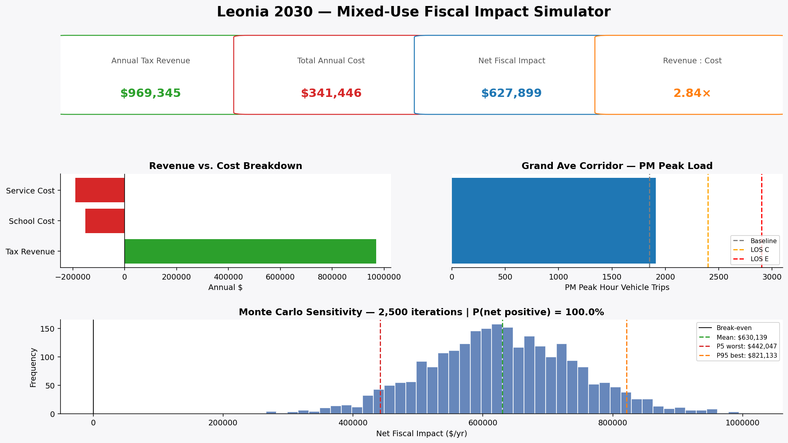

# Leonia 2030 — Mixed-Use Fiscal Impact Simulator



A data-driven Python model that estimates the **net fiscal impact** of proposed
mixed-use developments in Leonia, NJ — comparing new property-tax revenue
against the cost of educating new pupils and providing municipal services,
plus a PM-peak traffic impact analysis for the Grand Ave corridor.

Implements Burchell-style fiscal impact methodology with Monte Carlo
sensitivity analysis, exposed through a four-tab Streamlit dashboard so
non-technical decision-makers can interactively explore scenarios.

> **Author:** Jihoon Kong · **License:** MIT · **Status:** Planning-grade tool

---

## ⚡ Quick Start

```bash
# 1. Install dependencies
pip install -r requirements.txt

# 2. Sanity-check the model
python demo_run.py

# 3. Launch the dashboard
streamlit run app.py
```

Dashboard runs at `http://localhost:8501`.

---

## 🧭 Dashboard Tabs

| Tab | What it does |
|---|---|
| **Single Scenario** | Sliders + live KPIs + Monte Carlo distribution + downloadable memo |
| **Compare Two** | Side-by-side A/B scenarios with delta column |
| **Preset Scenarios** | One-click benchmark configurations (Modest, Family-heavy, Large TOD, Small infill) |
| **Methodology** | Formulas, sourced constants table, limitations |

---

## 📁 Project Structure

```
leonia2030/
├── leonia_constants.py      # Sourced fiscal/demographic/traffic parameters
├── fiscal_model.py          # Core calculator + Monte Carlo + PILOT support
├── app.py                   # Streamlit dashboard (4 tabs)
├── demo_run.py              # Headless demo + sensitivity sweep + charts
├── make_screenshot.py       # Regenerates the README hero image
├── test_model.py            # 10 unit tests
├── requirements.txt
├── LICENSE                  # MIT
├── .gitignore
└── README.md
```

---

## 📐 Methodology

### Revenue Side

```
Market Value   = Σ (SF × $/SF)                        residential + retail + office
Assessed Value = Market Value × Equalization Ratio    (Leonia ≈ 0.633)
Tax Revenue    = Assessed Value × General Tax Rate    (Leonia = 3.409%)
```

NJ municipalities don't assess at full market value. Leonia's
**Equalization Ratio** of ~63% means a $1M building sits on the tax rolls
at ~$633k. The General Tax Rate is then applied to that.

### PILOT Alternative

If the developer has a Long-Term Tax Exemption (very common in NJ
redevelopment areas), revenue follows a different formula:

```
PILOT Revenue = (units × annual rent × 10%) + (commercial SF × rent × 15%)
```

This typically reduces borough revenue by 40-60% versus standard property
tax. The dashboard exposes this as a checkbox so you can stress-test how
much a PILOT changes the math.

### Cost Side

```
New Pupils    = Σ (units × Rutgers CUPR PSAC multiplier)
School Cost   = Pupils × $21,420 per pupil per year
Residents     = Σ (units × household-size multiplier)
Service Cost  = Residents × $1,200 per resident per year
```

### Traffic Side (ITE 11th Edition, PM peak)

```
Residential trips  = Units × 0.39                       (LUC 221, mid-rise)
Retail trips       = (SF/1000) × 3.81 × (1 − 0.34)      (LUC 820, pass-by 34%)
Office trips       = (SF/1000) × 1.44                   (LUC 710)
```

### Monte Carlo

Each iteration draws residential `$/SF` from `N(425, 55)`, retail `$/SF`
from `N(310, 45)`, and interest rate from `N(6.5%, 1.5%)`. Higher rates
compress comp values via a linear sensitivity factor.

---

## 📚 Sourced Constants

| Parameter | Value | Source |
|---|---|---|
| General Tax Rate | 3.409 % | NJ Treasury — General Tax Rates, 2024 |
| Effective Tax Rate | 2.157 % | NJ Treasury — General Tax Rates, 2024 |
| Equalization Ratio | ≈ 0.633 | Derived (Effective ÷ General) |
| Cost per Pupil | $21,420 | NJDOE / Leonia Public Schools |
| District Enrollment | ~1,960 | NJDOE UFB 2025-26 (district 2620) |
| District Operating Budget | ~$44.1 M | NJDOE UFB 2025-26 |
| Leonia Population | 9,303 | U.S. Census QuickFacts, 2023 |
| PSAC, 1-BR multifamily | 0.01 | Rutgers CUPR (2006), Burchell/Listokin |
| PSAC, 2-BR multifamily | 0.14 | Rutgers CUPR (2006) |
| PSAC, 3-BR multifamily | 0.40 | Rutgers CUPR (2006) |
| PM-peak trip rate, mid-rise | 0.39 / DU | ITE 11th Edition, LUC 221 |
| PM-peak trip rate, shopping ctr | 3.81 / 1k SF | ITE 11th Edition, LUC 820 |
| Pass-by, shopping center | 34 % | ITE 11th Edition |

---

## 🎯 Benchmark Findings

| Scenario | Units | Retail | Net Fiscal | Pupils | PM Trips |
|---|---:|---:|---:|---:|---:|
| Modest mixed-use | 96 | 8,500 SF | +$588k | 7.1 | 59 |
| Family-heavy (3-BR loaded) | 100 | 4,000 SF | +$409k | 25.7 | 49 |
| Large TOD-style (1-BR heavy) | 200 | 20,000 SF | +$1.28M | 8.2 | 128 |

**Policy headline:** unit *count* drives revenue and traffic, but unit *mix*
drives school cost. A 100-unit project with predominantly 3-BR layouts can
generate 3× the pupils of a 200-unit project with predominantly 1-BRs — and
that's where the council's fiscal anxiety actually comes from.

---

## ⚠️ Limitations

This is a **planning-grade** model, not a substitute for a fiscal-impact study
by a certified planner or a full DEIS traffic analysis.

- **Service-cost approximation.** Police, DPW, parks, and admin costs are
  bundled into one per-resident figure. A Burchell per-capita-multiplier
  method would split these by department.
- **PSAC multipliers** reflect statewide averages. Transit-adjacent or
  luxury-rental products generate fewer pupils — see the Rutgers Center for
  Real Estate 2018 study for refined figures.
- **Traffic ignores mode shift.** TOD designs reduce vehicle trips. A real
  study would apply NCHRP 758 internal-capture and multimodal adjustments.
- **Interest-rate sensitivity is linear.** Real comp values move non-linearly
  through cap-rate compression.
- **PILOT model uses typical NJ rates** (10% residential / 15% commercial).
  Actual deals are negotiated and vary widely.

---

## 🧪 Running Tests

```bash
python -m unittest test_model.py -v
```

10 tests covering: empty developments, proportional assessment, 3-BR vs.
studio pupil generation, traffic impact, fiscal-impact contract,
reproducible Monte Carlo, sensible equalization ratio, PILOT-vs-standard
revenue comparison, ordered LOS thresholds, Monte Carlo summary statistics.

---

## 🛠️ Adapting for Other NJ Municipalities

This framework works for any NJ municipality — only `leonia_constants.py`
is town-specific. To adapt:

1. Update `GENERAL_TAX_RATE`, `EFFECTIVE_TAX_RATE`, `COST_PER_PUPIL`
2. Update `LEONIA_POPULATION` and `MUNICIPAL_SERVICE_COST_PER_RESIDENT`
3. Update Grand Ave traffic baselines to your local corridor counts
4. Replace the corridor name in `app.py` / dashboard captions

The math itself (Rutgers PSAC multipliers, ITE trip rates, Burchell
methodology) is statewide / national and doesn't change.

---

## 📜 Citation

If you adapt this model, please credit the underlying data sources
(Rutgers CUPR, ITE, NJDOE, NJ Treasury, U.S. Census) and the methodology
of Burchell/Listokin. The MIT license permits any use; attribution is
appreciated.
